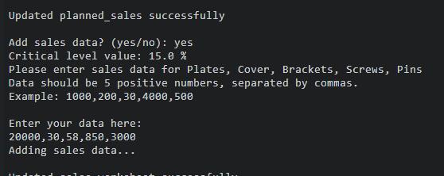
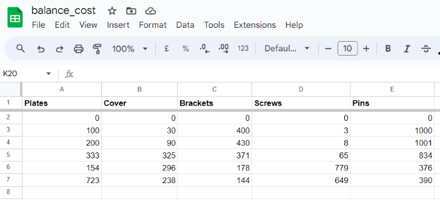

# STOCK BALANCE CALCULATOR 

This site enables control and planning of stock in a warehouse at a level which balances the requirements between available space versus sales or preventing costly slow-moving inventory yet still preventing potential shortages, furthermore it can be used to plan production and avoid potential shortages based on previous sales trends.

Start up page 


Link to the site:
[STOCK BALANCE CALCULATOR](https://balancestockone-d671f64958d2.herokuapp.com/)

Link to gsreadsheet:
[balance_cost](https://docs.google.com/spreadsheets/d/1yVF_vHRsd5iUPxqPZM8spsaaGX2B8JLeBPi9Lx5JGIE/edit?pli=1#gid=1269880517)

## CONTENTS

- [STOCK BALANCE CALCULATOR](#stock-balance-calculator)
  - [CONTENTS](#contents)
  - [User Experience (UX)](#user-experience-ux)
    - [User Stories](#user-stories)
  - [Design](#design)
  - [Features](#features)
    - [Future Implementations](#future-implementations)
    - [Accessibility](#accessibility)
  - [Technologies Used](#technologies-used)
    - [Languages Used](#languages-used)
    - [Frameworks, Libraries \& Programs Used](#frameworks-libraries--programs-used)
  - [Deployment \& Local Development](#deployment--local-development)
    - [Deployment](#deployment)
    - [Local Development](#local-development)
      - [How to Fork](#how-to-fork)
      - [How to Clone](#how-to-clone)
  - [Testing](#testing)
    - [Testing User Stories from (UX) Section](#testing-user-stories-from-ux-section)
      - [Validator Testing](#validator-testing)
      - [Further Testing](#further-testing)
  - [Credits](#credits)
    - [Code Used](#code-used)
    - [Content](#content)
    - [Acknowledgments](#acknowledgments)

---

## User Experience (UX)

- __Initiation of concept__
Keeping track of the available storage space capacity in a warehouse and avoiding items occupying shelves and still keeping items to support demand can be a complex task. By providing a tool that allows users to set the minimum and maximum quantities for specific items, the user will be notified of any risk of exceeding these boundaries. This function enables the warehouse owner to order correct quantities at the right time.

  
- __Key goals for the site__

  - To offer a service which monitors high- and low volume items.
  - To offer a possibility to optimize stock balance by user input.
  - To check how the input changes with updated quantities added by the user.


### User Stories

- __First time user:__
    I am:
  - Learning about the main purpose of the site.
  - Understanding how the site could support planning of production or sales.


- __Returning User:__
    I am:  
  - Actively trying to add various level of critical levels to check the impact
  - Trying to a longer range of values to investigate how average of stock can be calculated 
    for various items.

## Design

This project is a command line based program with a user prepared input window run through heroku, no exclusive design besides the interface provided by heroku are added.

### Flowchart
The image below illustrates the basic flowchart structure for the project.


## Features
   
   The result of the code is written to a gspreadsheet which contains five different tabs further described below
 - Stock 
   - The values printed to the associated sheet for stock data are one row "offset" compared to the other sheets, meaning that for the initial run of the program the gspread sheet will be populated with '0' (unless the user has entered other data to be set at initial run) for each item in row number 2 whereas the other sheets will be empty except for the header (row number one). The purpose with displaying stock level one time period (representing e.g., day, week, month) ahead of the other sheets is to prepare for the next production run, sales or similar. The stock values are calculated by multiplying the user's chosen "critical level" with the average sales from previous weeks, hence the first initial sales averages will be the same as the entered values. By using a critical level, the target is to optimize and handle temporary fluctuations e.g. avoiding to order more than necessary both for financial or physical space reasons after temporary peak in sales (which could be the case if the calculation for next stock was simply based on the previous sales). A similar purpose is also valid for the opposite scenario where the suggested stock level can prevent the risk of delaying deliveries due to shortage. 
      
 - Critical level
   - The "critical level" is a value that the user can choose to use as a way to control the minimum share quantities (based on sales) to be available before the next order of them. In the delivered code the value is integers between 1 to 50 representing 1 to 50 % of average sales, however this can easily be updated by changing these values to change the range per user request.
     - Error handling:
       - If the user entered non-integer characters or nothing an error message will be prompted as follows "You entered invalid data. Please try again".


 - Sales
   - When a user adds sales data which can also be equivalent to any type of order, the actual calculation of stock, surplus and planned sales starts.
     - Error handling:
       - If the user entered non-integer characters or nothing an error message will be prompted as follows "You entered invalid data. Please try again".
       - If the user entered the wrong number or values or five values where at least one is negative, the error message will be the following: "Exactly 5 positive values required."


- Surplus 
  - The surplus value illustrates how the latest sales or orders affected the current balance between existing stock and sales, the value written to the gspreadsheet can be interpreted as the number of orders to prepare to maintain the current stock without using the calculation of average sales and critical level.

- Planned sales
  - The planned sales values represent the actual values needed to produce or prepare for achieving the target value of stock. These values are calculated by adding the surplus value with the product of average sales and the critical level value. A negative value in this sheet indicates that no production of this item is needed in that specific timeframe, the stock data is sufficient to manage the requested stock for next time the program runs.

### Program procedures
In the following description, the definition of "session" is equivalent to a program run without existing and restarting the program.

The program can be run in one or multiple sessions, where the first mentioned handles one time of adding critical level, sales and then the sessions ends.
If no invalid data is entered, the following steps will be performed from a user perspective with a single session:
1. Run program.
2. Enter critical level data.
3. Enter sales data.
4. Enter "no" when being asked for adding more sales data (yes or no).
5. A list from the latest sales (maximum four sessions) will be presented to the user in the program, this is followed by a goodbye
   message and the session ends.


#### Program procedure - multiple sessions

When a user wish to perform several sessions, the program will return to step 3 instead of exiting the program from step 4 and as long as the user enters
"yes" in step 4 this will continue.


For a "two-session" program run, these will be the steps.

1. Run program.
2. Entered critical level data.
3.(1) Enter sales data.
4.(1) Enter "yes" when being asked for adding more sales data (yes or no).
3.(2) Enter sales data.
4.(2) Enter "no" when being asked for adding more sales data (yes or no).
5. A list from the latest sales (maximum four sessions) will be presented to the user in the program, this is followed by a goodbye
   message and the session ends.

In the below example a session with two runs will be presented, also images from the gspreadsheet will be added to visualize the data flow and how values are fetched and written to the gspreadsheets. In the example three sessions have already been stored and two more sessions will be added.

Adding two sessions of values to the gspreadsheets:

- Before running the program the state of the sales sheets has been updated with three sessions, note that all sheets except the stock sheet will have three rows of data added to them once the sessions have completed successfully. An additional row will always be present on the stock sheet after a session since this is the data that will be the basis to use for the next session.

Although the stock data has a one row "offset" compared to the other sheets, once the critical data has been entered by the user the critical value sheet will have the equal number temporarily after the user has entered this value but has not yet added sales data.

----------------------------------------------------------------------------
-- Status of sales and critical level sheets before any update--:

SALES


CRITICAL LEVEL


-----------------------------------------------------------------------------

-- Status of sales and critical level sheets after enter the critical level--:
The value of 15 was entered.

FROM PROGRAM


CRITICAL LEVEL (Note the latest value added to the fifth row)


-----------------------------------------------------------------------------

-- Status of sales after enter sales data--:
Following values were entered: 100,4000,300,20000,3


-----------------------------------------------------------------------------

-- Status of sales, critical level after enter yes on "add more sales data"--:

Note that in this stage, when the user enters "yes" the critical level values are copied from the latest valid values entered by the user and these 
values are used to calculate the current session for stock and planned sales data.

FROM PROGRAM



CRITICAL LEVEL SHEET


STOCK SHEET




----------------------------------------------------------------------------

-- Status of sales, critical level after enter no on "add more sales data"--:

FROM PROGRAM 

Note that the trend for the last four sessions are presented, the latest values (20000, 30, 58, 850, 3000) are the ones at the end of each line.


SALES SHEET


----------------------------------------------------------------------------

### Future Implementations
  - In a more advanced version of this program, the focus would be to add a capability sheet or input. This variable could be based
  on the planned sales data and could evaluate the available and needed resources to produce the requested items. By adding this feature the user's possibilities to 
  plan activities would be improved, furthermore this functionality could also include a value recommended by the program for stock and critical level to the user based on existing statistics.

### Accessibility

- I have been mindful during coding to ensure that the website is as accessible and user friendly as possible. I have achieved this by:
- Coding according to PEP8 standard.
- Adding useful comments for each code block.

## Technologies Used

### Languages Used
- Python
### Frameworks, Libraries & Programs Used

- [Draw](https://app.diagrams.net/) - For creating flowchart.

- Git - For version control.

- Github - To save and store the files for the website.

- [Google gspreadsheet](https://www.google.com/sheets/about/)

- [Heroku](https://dashboard.heroku.com/apps/) - Deployment platform.


## Deployment & Local Development

The project was deployed using GitHub pages. The steps to deploy using GitHub pages are:

Go to the repository on GitHub.com
Select 'Settings' near the top of the page.
Select 'Pages' from the menu bar on the left of the page.
Under 'Source' select the 'Branch' dropdown menu and select the main branch.
Once selected, click the 'Save'.
Deployment should be confirmed by a message on a green background saying "Your site is published at" followed by the web address.

# Deployment
Codeanywhere IDE was used to write the code for this project and the Application has been deployed from GitHub to Heroku using the steps below with version releasing active.

## Heroku deployment
Deployment steps are as follows, after account setup:

* Select New in the top-right corner of your Heroku Dashboard, and select Create new app from the dropdown menu.
* Add a unique app name and then choose a region closest to you (EU or USA).
* Click on Create App.

In order for the project to run on Heroku, Heroku is needed to install the dependencies. 
* In the terminal write the following commando `pip3 freeze > requirements.txt` to create a list of requirements. The list of dependencies will go into the `requirements.txt` file.

The sensitive data needs to be kept secret and Heroku will build the app using the code in the Github. The creds.json file is protected in the .gitignore file and these credentials are needed in order to connect to the API. To allow the Heroku Application to access the spreadsheet the following steps are needed:

* From the new app Settings, click Reveal Config Vars, and set the value of KEY to **CREDS** (all capital letters), and go to the repository, copy the entire`creds.json` then paste it into the VALUE field. Then click "Add". Add another KEY called **PORT** and VALUE **8000**, then click "Add".
* Further down, to support dependencies, select Add Buildpack.
* The order of the buildpacks is important, select Python first, then click "Save changes". Then add Node.js second and click "Save changes" again. If they are not in this order, you can drag them to rearrange them.
* Go to "Deploy" and select "GitHub" in "Deployment method".
* To connect Heroku app to your Github repository code enter your repository name, click 'Search' and then 'Connect' when it shows below
* Choose the branch you want to build your app from.
* If preferred, click on "Enable Automatic Deploys", which keeps the app up to date with your GitHub repository.
* Wait for the app to build. Once ready you will see the “App was successfully deployed” message and a 'View' button to take you to your deployed link.

[GitHub repository](https://github.com/luandretta/quiz-python) 

## Run locally
**Making a Local Clone**
1. Login or Sign Up to GitHub.
2. Open the project [repository](https://github.com/luandretta/quiz-python).
3. Click on the code button, select whether you would like to clone with HTTPS, SSH or GitHub CLI and copy the link shown.
4. Open the terminal in the code editor of your choice and change the current working directory to the location you want to use for the cloned directory.
5. Type 'git clone' into the terminal and then paste the link you copied in step 3. Press enter.

Add the files in your new local repository. This stages them for the first commit:
```bash
$ git add .
```

To unstage a file, use:
```bash
$ git reset HEAD YOUR-FILE
```

Commit the files that you've staged in your local repository:
```bash
$ git commit -m "First commit"
# Commits the tracked changes and prepares them to be pushed to a remote repository. To remove this commit and modify the file, use 'git reset --soft HEAD~1' and commit and add the file again.
```

Push the changes in your local repository to GitHub.com:
```bash
$ git push origin main
# Pushes the changes in your local repository up to the remote repository you specified as the origin
```

**Forking the GitHub Repository**
To fork this website to either propose changes or to use as an idea for another website, follow these steps:
1. Login or Sign Up to GitHub.
2. Open the project [repository](https://github.com/luandretta/quiz-python).
3. Click the Fork button in the top right corner.
4. Copy of the repository will be in your own GitHub account.

To deploy from GitHub, follow these steps:

1. Log into your GitHub repository, create a GitHub account if necessary.
2. Click 'Settings' in the main Repository menu.
3. Click 'Pages' from the left-hand side navigation menu.
4. Within the Source section, click the "Branch" button and change from 'None' to 'Main'.
5. The page should automatically refresh with a url displayed.
6. Test the link by clicking on the url.

The url for this website can be found [here](https://quizpython.herokuapp.com/) 
## Create data model and integrate using an API

- **Create a Spreadsheet (Data Model)**

1. Login to your Google account, create an account if necessary.
2. Navigate to Sheets, Google's version of Microsoft Excel.
3. Start a new spreadsheet, amend the title at the top i.e., quiz_python.
4. Create 2 Sheets/Tabs, titling 'questions' and 'answers'.
5. Add the data according to the screenshot in [Used-technologies](#used-technologies).


- **Setup API**

1. Navigate to Google Cloud Platform.
2. If you do not already have a profile then follow the basic steps for creating an Account, via clicking on the 'Get Started for Free' button in the upper right corner.
3. Once the previous step is complete, create a new project with a unique title.
4. Click on the "Select Project" button to bring you to your project page.
5. You should now arrive at the project dashboard and be ready to setup the required credentials:
- Access the navigation menu from clicking on the burger icon (three horizontal lines menu icon) in the top left corner of the page.
- Select APIs and Services, followed by 'Library'.
- Search for and select Google Drive API -> Enable.
- Search for and select Google Sheets API -> Enable.
- Click Enable to navigate to 'API and Services Overview'.
- Click Create Credentials in the upper left of the screen.
- For Credential Type, select 'Google Drive' from the dropdown.
- For 'What data will you be accessing' select Application Data.
- For 'Are you planning to use this API with Compute Engine...?' choose 'No, I'm not...'.
- Click Next.
- Within the Create Service Account page, enter a Service Account Name, then click Create.
- Next within 'Grant this service account access to project', choose Basic -> Editor from the 'Select a Role' dropdown and click Continue.
- Next within 'Grant users access to this service account', choose 'Done'.
- On the following, click on the 'Service Account Name' you created to navigate to the config page.
- Navigate to the Keys section.
- Select 'Add Key' dropdown -> Create New Key.
- Select 'JSON' and then click Create. This will trigger the json file with your API credentials in it to download to your machine.
- Go back to the library and search for "google sheets".
- Click Enable.
- From your local downloads folder, add the file directly to your Gitpod workspace, and rename the file to creds.json.
- Within the file, copy the value for 'client email'. 
- Paste this email address into the 'Share' area of your Google Sheet, assign the role of Editor, untick "Notify People" and then click "share".


Enable API within IDE

- From within your GitPod IDE terminal, enter 'pip3 install gspread google-auth'.

- At the top of your Python file add the following lines:
```python
import gspread
from google.oauth2.service_account import Credentials
```

- Below this add the following code:
```phyton
    SCOPE = [
        "https://www.googleapis.com/auth/spreadsheets",
        "https://www.googleapis.com/auth/drive.file",
        "https://www.googleapis.com/auth/drive"
       ]

CREDS = Credentials.from_service_account_file("creds.json")
SCOPED_CREDS = CREDS.with_scopes(SCOPE)
GSPREAD = gspread.authorize(SCOPED_CREDS)
SHEET = GSPREAD.open("quiz_python")
```

---

## Testing

### Testing User Stories from (UX) Section
-  As a user I am interested in the website's purpose and interested in testing the basic function.
  - The site has a clear structure and the data is entered in steps explained at the starting page. 
  - When ending a session the site will display the latest sales in the program which enables the user to follow how data is added to the sheets directly in the program environment.


- As a user I am understanding how results are affected by adding multiple rows of data.
  - The user can monitor the results in the gpsreadsheet actively and follow the different steps how the critical level is updated and then also being able to compare how 
    the data is updated after sales are added for all sheets.
  - The user will be displayed a value of the critical level if the user answers yes to add more sales data in a session, this will make it clear which critical level is used for each session.


####  Validator Testing
CI Python Linter
  - The code has passed the test without any errors found by testing it in codeanywhere, however if the code is tested directly from
  GitHub in CI Python Linter it will claim an error for 307: W292 no newline at end of file (unless you manually edit the code directly in GitHub 
  adding that empty row that the CI Python Linter expects, then it will pass but editing code in github should be avoided). To solve this 
  issue a comment is added in the end of the file, this will make sure an empty 
  line is inserted after the final code (main) if the workspace is forked making it work properly.


####  Further Testing

- Critical level
  - The following values were entered to test error functionality: 'a' , ',' , '2,3'. Also nothing was added and enter was pressed. 
    - All tests were correctly handled with the response: "You entered invalid data, please try again."
  - The following values were entered to test error functionality: '-10' , '0'  , '100'
    - All tests were correctly handled with the response: "Value outside the valid range (1 - 50)."

- Sales 
  -The following values were entered to test error functionality: 'a' , ',' , '-'. Also nothing was added and enter was pressed. 
    - All tests were correctly handled with the response: "You entered invalid data, please try again."
  - The following values were entered to test error functionality: '-10' , '-10,-10,-10,-10,-10'  , '30,30,30,30' , '60,60,60,60,60,60'  , '0'.
    - All tests were correctly handled with the response: "Exactly 5 positive values required"

- Gspreadsheets
  - The name and email field was tested individually, the error message is shown for the name field regardless of the status for the email field and vice versa. The send result button is only enabled once both fields are valid, and if any field is changed before sending the mail, the button is set to disabled again.

- Browser Testing
  - The Website was tested on Google Chrome, Firefox, Microsoft Edge, and Safari browsers with no issues noted, except the deviations described in "known bugs/compromise" section below. 

- Interruption test
  - A test was also performed which simulates when a user has entered critical level but is interrupting it with CTRL C, the program shall then start over and the latest critical
    level shall be removed to start a new session. The program worked as intended and prevented a critical level to be updated twice without having the sales data being updated after the first entry.

- Solved bugs
  -  Initially there was a problem to copy the values from the critical level sheet to the next row if the user entered yes (on the question if the user wants to add more sales data), the values were added three times, but after a review of the logic the issue could be solved.

- Known Bugs/compromise
  - There are no known bugs, however there was a timeout error related to the gpsreadsheet which seemed to be connected to codeanywhere specifically (the error was not noticed in Heroku). By removing an unnecessary else statement in the "get critical level" code block the issue seems to be resolved, it was not possible to reproduce the problem in codeanywhere. still it could be worth mentioning this scenario if the code were supposed to be run in codeanywhere which seems to be having an impact on the stability in general for the program due to server issues (the latest comment is input from codeanywhere support).
    

## Credits
### Code Used 

- Specific coding
  - The coding has similarities with "love sandwiches" walkthrough project, more specifically it is the way to update the worksheets (the code block called def update_worksheet(data, worksheet):. This process to update the sheets after each calculation could be seen as a rather general method, furthermore, this existing code is concise and inventing a new alternative code doing the same thing was considered irrational and did not add any user value.
  To summarize; the uniqueness for the project code is rather the concept of how the critical level, average sales are calculating stock and planned sales.

 - General coding
   - For inspiration and tips the major sources were:
   - [W3 Schools](https://www.w3schools.com)
   - [Mozilla](https://developer.mozilla.org/en-US/docs/Learn)


### Content

The idea is my own on how to code the calculation model, some basics (as mentioned in the previous section) on how to connect the gspreadsheets are inspired by the love sandwich project. The concept of adding a table presenting the latest sales before exiting the program was requested by my mentor.


### Acknowledgments

- I would like to thank the following:
  - Antonio Rodriguez (mentor) for guidance and support. 
  - My family - for their patience with having me coding sometimes late evenings and nights.  